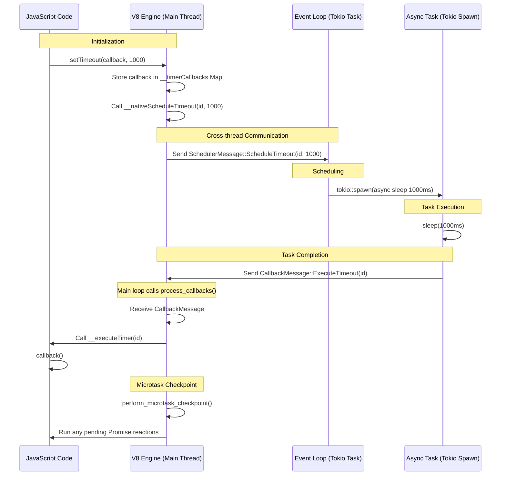

# ToyJS Event Loop Architecture

This document describes the event loop implementation in ToyJS, which facilitates asynchronous operations like timers and network requests by bridging the V8 JavaScript engine with the Rust Tokio runtime.

## Overview

ToyJS employs a dual-threaded architecture for its event loop:

1.  **Main Thread (V8 Thread)**: Responsible for executing JavaScript code, managing the V8 Isolate and Context, and processing completed asynchronous callbacks.
2.  **Event Loop Thread (Tokio Task)**: A background task running in the Tokio runtime that manages asynchronous operations (timers, fetch requests) and schedules their completion.

The two threads communicate via asynchronous, unbounded MPSC (Multiple Producer, Single Consumer) channels.

## Components

### 1. Communication Channels

*   **Scheduler Channel (`scheduler_tx`/`scheduler_rx`)**: Transmits messages from the V8 thread to the Event Loop thread to schedule new asynchronous tasks.
*   **Callback Channel (`callback_tx`/`callback_rx`)**: Transmits messages from the Event Loop thread back to the V8 thread when a task is complete and its JavaScript callback is ready to be executed.

### 2. Rust Runtime (`JsRuntime`)

The `JsRuntime` struct in `src/runtime.rs` manages the V8 lifecycle and the communication channels.
*   `run_event_loop()`: Spawns the background Tokio task.
*   `process_callbacks()`: Drains the `callback_rx` channel and executes the corresponding JavaScript functions. It also triggers V8's microtask checkpoint.

### 3. Event Loop (`run_event_loop`)

Located in `src/runtime/event_loop.rs`, this function runs in a loop, listening for `SchedulerMessage`s:
*   `ScheduleTimeout`: Spawns a task that sleeps and then sends an `ExecuteTimeout` message.
*   `ScheduleInterval`: Spawns a task that ticks on an interval and sends `ExecuteInterval` messages.
*   `Fetch`: Spawns a task that performs an HTTP request using `reqwest` and sends `FetchSuccess` or `FetchError` messages.

### 4. JavaScript Bindings

Asynchronous features are implemented by combining native Rust functions with JavaScript wrappers (see `src/runtime/timers.rs` and `src/runtime/fetch.rs`):
*   **Wrappers**: `setTimeout`, `setInterval`, `fetch` are defined in JS. They generate a unique ID, store the callback in a global `Map`, and call a "native" binding.
*   **Native Bindings**: Functions like `__nativeScheduleTimeout` send messages to the Rust scheduler.
*   **Executors**: Global JS functions like `__executeTimer` and `__executeFetchSuccess` are called by Rust's `process_callbacks` to trigger the original JS callbacks.

## Event Loop Sequence Diagram

The following diagram illustrates the flow of an asynchronous operation (e.g., `setTimeout`).

## Microtasks vs. Macrotasks

ToyJS distinguishes between:
*   **Macrotasks**: Timers and Fetch responses are processed between turns of the JavaScript execution, specifically when `process_callbacks()` is called from the main application loop.
*   **Microtasks**: Promise resolutions and `queueMicrotask` are handled by V8 itself. `process_callbacks()` explicitly calls `tc_scope.perform_microtask_checkpoint()` to ensure these are processed after each batch of macrotask callbacks.
